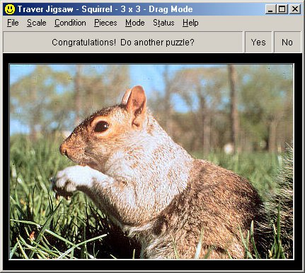



## Traver Jigsaw

### Description

Jigsaw program. Load in any JPEG, GIF, etc., as picture. Pieces can be set from 2 x 2 to 12 x 12. Show picture as "normal" size or optimized for screen. Other features: save a position, restore it, provide hidden help, report on progress, print out the picture.
 
### More Info
 
The program can load in any JPEG or GIF file (and can handle many other standard graphics formats as well).

A new user needs to know nothing before using the commented code or making minor modifications in it.

The program can store information about a picture and position so that the same picture and position can be restored lateer.

             |
---                |---
**Submitted On**   |2001-12-26 21:13:44
**By**             |[Barry Traver](https://github.com/Planet-Source-Code/PSCIndex/blob/master/ByAuthor/barry-traver.md)
**Level**          |Advanced
**User Rating**    |4.8 (19 globes from 4 users)
**Compatibility**  |VB 6\.0
**Category**       |[Games](https://github.com/Planet-Source-Code/PSCIndex/blob/master/ByCategory/games__1-38.md)
**World**          |[Visual Basic](https://github.com/Planet-Source-Code/PSCIndex/blob/master/ByWorld/visual-basic.md)
**Archive File**   |[Traver\_Jig4412012262001\.zip](https://github.com/Planet-Source-Code/barry-traver-traver-jigsaw__1-30015/archive/master.zip)

